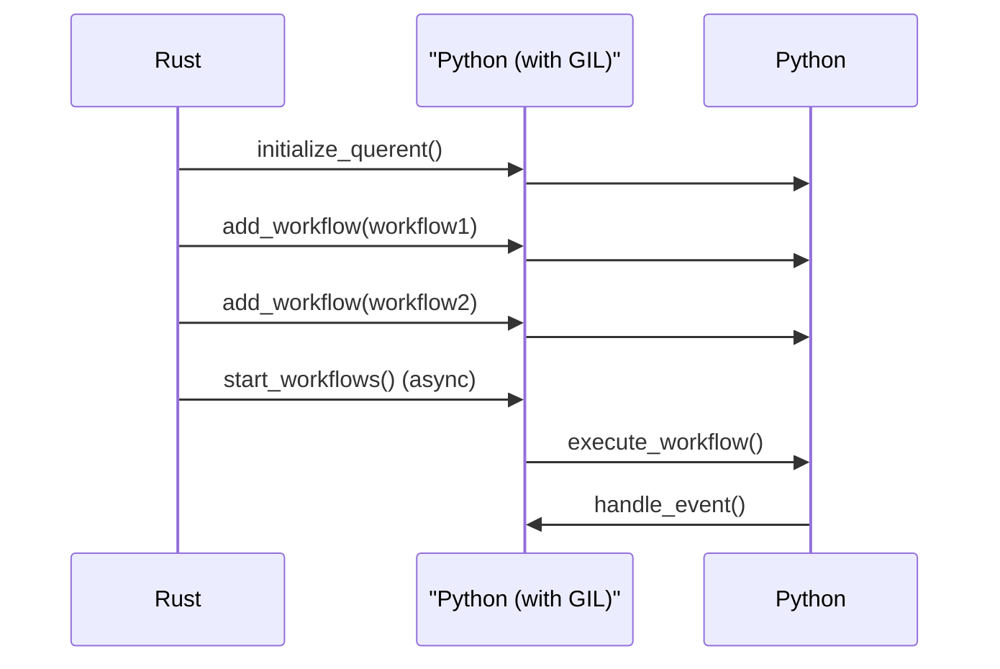

# Querent SDK for Rust

The Querent SDK for Rust facilitates seamless integration with Querent, an advanced asynchronous data processing engine, from Rust applications. This SDK streamlines the incorporation of Querent workflows, offering a straightforward approach to initiate, manage, and interact with Querent operations in Rust.

## Features

- Commence Querent workflows effortlessly from Rust applications.
- Streamline interaction with Querent workflows, handling input and output data.
- Trigger Querent events and callbacks directly from Rust.
- Simplify the integration of Querent into Rust-based projects.

## Installation

To utilize the Querent SDK for Rust, include it in your `Cargo.toml`:

```toml
[dependencies]
querent_rs = "0.1.0"
```

## Usage

Below is a basic example of starting a Querent workflow from a Rust application:

```rust
use querent_rs::{Querent, WorkflowBuilder, Config, PyEventCallbackInterface, py_runtime_init};

fn main() {
    // Initialize the Python runtime
    py_runtime_init();

    // Create a Querent instance
    let mut querent = Querent::new();

    // Define the first workflow using the builder pattern
    let workflow1 = WorkflowBuilder::new("workflow_id_1")
        .name("My Workflow 1")
        .import("my_module")
        .attr("start_function")
        .add_argument(42)
        .config(Config::default())
        .event_callback(PyEventCallbackInterface::new())
        .build();

    // Define the second workflow
    let workflow2 = WorkflowBuilder::new("workflow_id_2")
        .name("My Workflow 2")
        .import("another_module")
        .attr("start_function")
        .add_argument("example_argument")
        .config(Config::default())
        .event_callback(PyEventCallbackInterface::new())
        .build();

    // Add workflows to Querent
    querent.add_workflow(workflow1).expect("Failed to add workflow 1");
    querent.add_workflow(workflow2).expect("Failed to add workflow 2");

    // Start workflows asynchronously
    querent.start_workflows().await.expect("Failed to start workflows");
}

```

**Sequence Diagram:**



## Getting Help

If you encounter any issues or have questions regarding the use of the Querent SDK for Rust, please feel free to reach out on our community support channels.

## License

The Querent SDK for Rust is provided under the Apache 2.0 License. See the [LICENSE](LICENSE) file for details.
